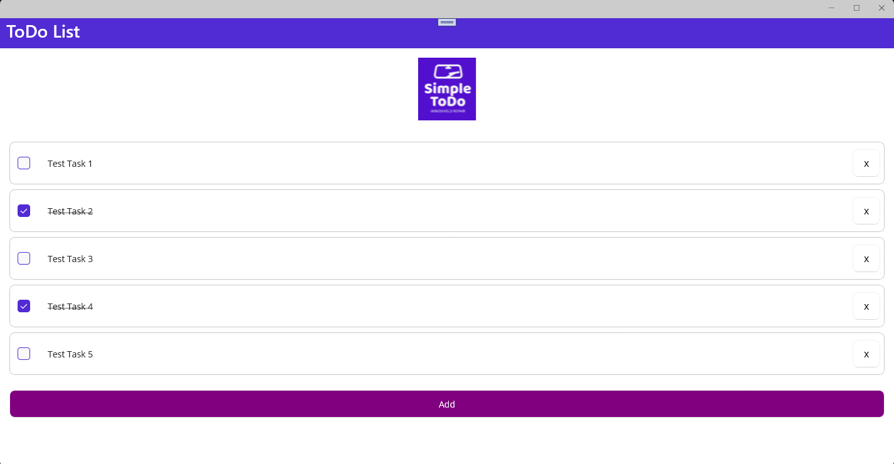
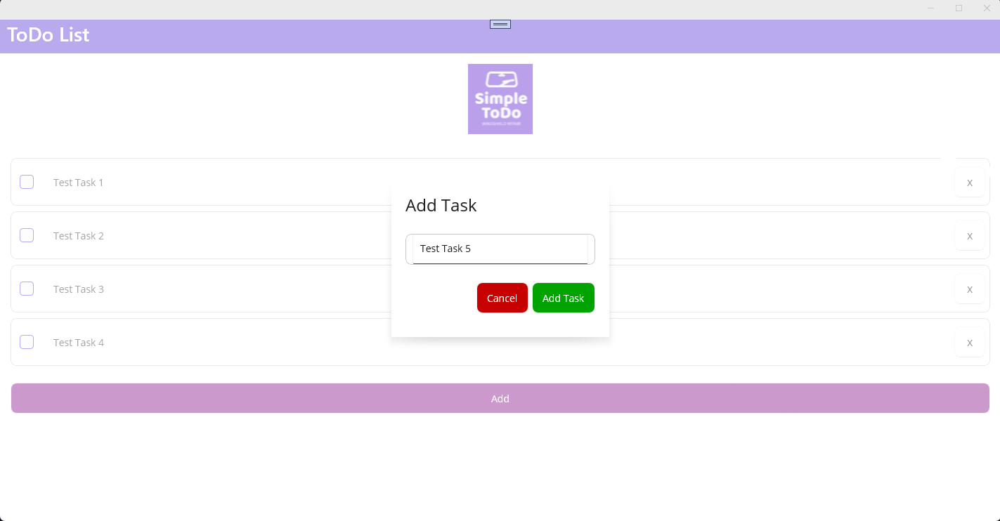
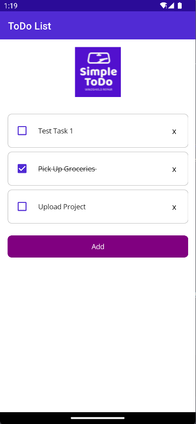
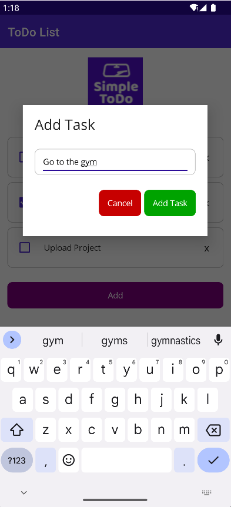

# Todo List App using .NET MAUI

This repository contains a Todo List app built using .NET MAUI. The app allows you to add new tasks, view existing tasks, mark tasks as completed with a checkbox, and remove tasks from the list. The app follows the Model-View-ViewModel (MVVM) architecture, ensuring a clean separation of concerns.

## Screenshots
Here are a few screenshots showcasing the user interface and functionality of the Todo List app:

Description: The main screen and add task screen for the windows platform.  

&emsp;&emsp;

Description: The main screen and add task screen for the android platform.

## Prerequisites
Before running the app, make sure you have the following prerequisites installed:

- Visual Studio
- .NET Core 7
- .NET MAUI
- Android SDK Platform 33
- Android 12.0 S
- CommunityToolkit.Maui (NuGet Package)
- CommunityToolkit.Mvvm (NuGet Package)

## Getting Started
To get started with the Todo List app, follow these steps:

1. Clone this repository to your local machine:
`https://github.com/Hashim-Atiq/simpleToDo-MAUI.git`

2. Open the solution file (SimpleToDo.sln) in Visual Studio.

3. Select the desired target platform (Android, iOS, or Windows) and run the app from your IDE. Let's use the android platform.

4. Install the android device to run the application. For this project I used Pixel 5 - API 33.

## Features
The Todo List app includes the following features:

- Add new tasks: Enter a task description and click the "Add" button to add it to the list.
- View tasks: The app displays a list of tasks with their current status (completed or not).
- Mark tasks as completed: Check the checkbox next to a task to mark it as completed, visually crossing it out.
- Remove tasks: Click the delete button next to a task to remove it from the list.

## Feedback and Contributions
Your feedback and contributions to this project are highly appreciated. If you encounter any issues, have suggestions for improvements, or would like to contribute enhancements, please feel free to open an issue or submit a pull request.

## Acknowledgments
This project was developed to explore the capabilities of .NET MAUI and showcase the implementation of a Todo List app using the MVVM architecture. I would like to express my gratitude to the .NET MAUI development team and the open-source community for their excellent work and contributions.

## Resources
- [.NET MAUI Documentation](https://learn.microsoft.com/en-us/dotnet/maui/)
- [.NET MAUI GitHub Repository](https://github.com/dotnet/maui)

## About the Author
This project was created by Hashim Atiq. Feel free to connect with me on [LinkedIn](https://www.linkedin.com/in/hashim-atiq/) to stay updated on my latest projects and to engage in discussions.

Stay organized and keep track of your tasks with the Todo List app!

## Disclaimer
Please note that this application does not currently implement persistent data storage. Any data you enter or modify within the app will only persist for the duration of the application's runtime. Once the application is closed or restarted, the data will be reset.
